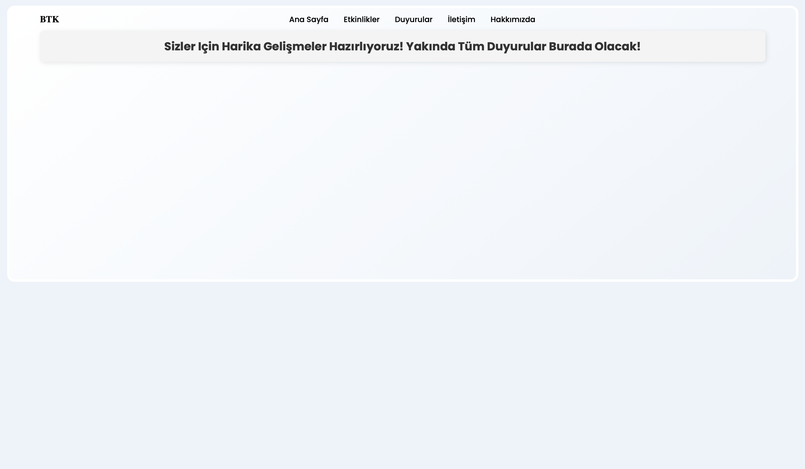
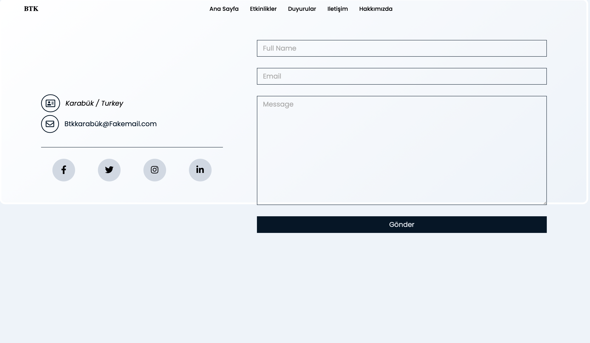
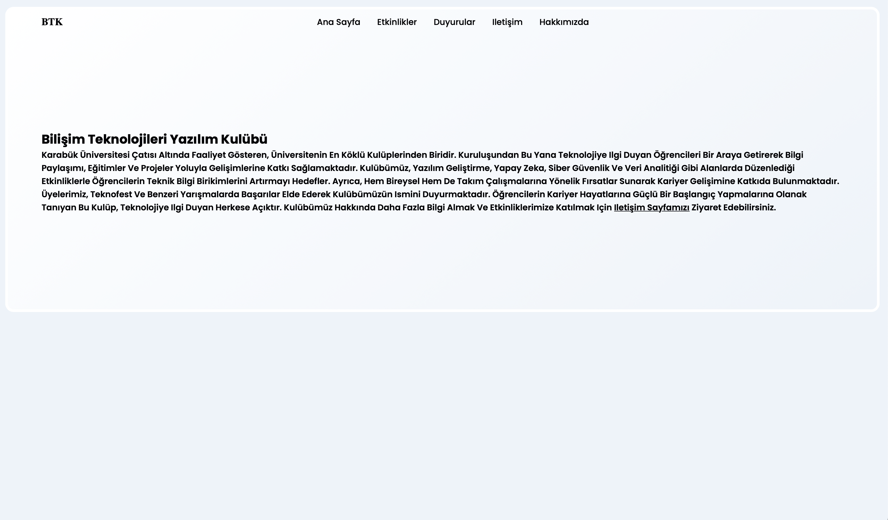

# BTK-WebSite

# Karabük University Information Technologies and Software Club Website

This project is a website developed for the **Karabük University Information Technologies and Software Club (BTK)**. It is designed to share club activities, announcements, and contact information.

## 🚀 Features
- **Home Page**: Provides general information about the club and navigation.

- **Announcements Section**: A dedicated area for sharing the latest announcements.

- **Events Section**: Lists the events organized by the club.

- **Contact Section**: Allows users to get in touch with the club.

- **About Us Section**: Contains detailed information about the club.


## 🛠 Technologies Used
- **HTML**: Used for structuring the website.
- **CSS**: Used for styling and design adjustments.
- **JavaScript (JS)**: Used for dynamic content management and interactions.

## 📦 Installation
Follow these steps to run the project locally:

1. **Clone the repository**
   ```sh
   git clone https://github.com/mratsag/BTK-Website.git
   ```
2. **Navigate to the project folder**
   ```sh
   cd BTK-Website
   ```
3. **Open in a browser**
   - Open the `index.html` file in a web browser to view the project.

## 📬 Contact
If you encounter any issues or have suggestions, feel free to reach out through the following channels:

- **GitHub**: [mratsag](https://github.com/mratsag)
- **Email**: [mrat.sag@hotmail.com](mailto:mrat.sag@hotmail.com)

---

This project was developed for the Karabük University Information Technologies and Software Club. 🎯
